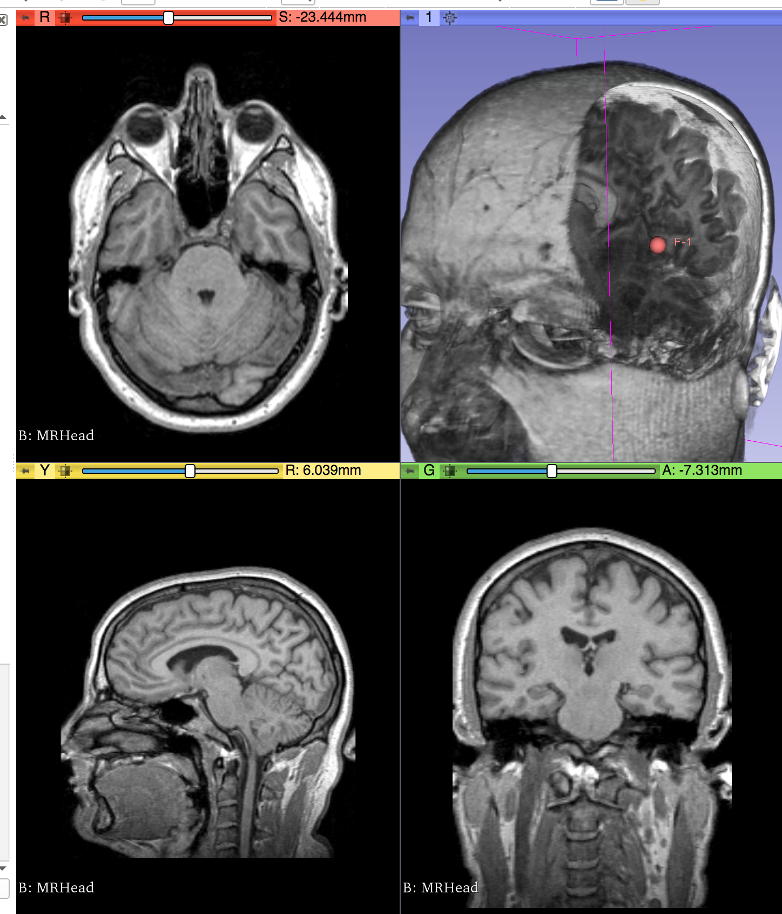

# Note: this functionality is now a test in Slicer [ShaderProperty test](https://github.com/Slicer/Slicer/blob/master/Applications/SlicerApp/Testing/Python/ShaderProperties.py)

## The information below and this repository are for historical purposes only.

Example scripts for customizing VTK shading language.

Developed at [NA-MIC Project Week in Las Palmas](https://github.com/NA-MIC/ProjectWeek/blob/master/PW28_2018_GranCanaria/Projects/MultiVolumeRendering/README.md)

See [the project page for more details](https://github.com/NA-MIC/ProjectWeek/blob/master/PW28_2018_GranCanaria/Projects/MultiVolumeRendering/README.md)

Here's a video: https://youtu.be/yiEI_yBMu8k

Here's what it looks like:

# Howto

* For the SlicerShader, just paste it into a binary download of Slicer (tested on Nightly release of June 2019)
  * [Proof of concept script to paste in python console](https://github.com/pieper/VTKCustomShaders/blob/master/SlicerShader.py)
  * [Works with this data](https://github.com/NA-MIC/ProjectWeek/releases/download/ThursdayEvening-2018-06-28/2018-06-28-Scene.mrb)
* For DepthShader stand-alone
  * build vtk with python enabled
  * run a command like: `../vtk-build/bin/vtkpython DepthShader.py`
